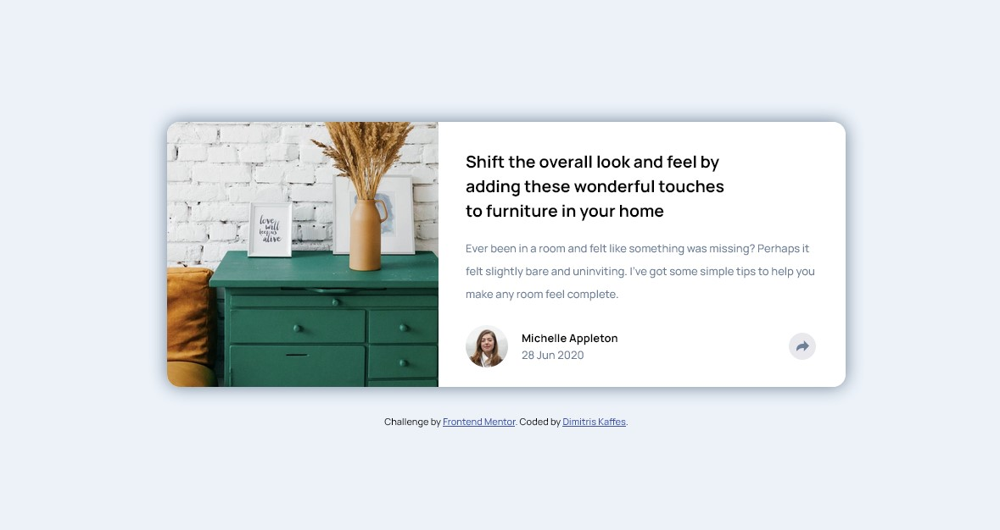

# Frontend Mentor - Article preview component solution

This is a solution to the [Article preview component challenge on Frontend Mentor](https://www.frontendmentor.io/challenges/article-preview-component-dYBN_pYFT). Frontend Mentor challenges help you improve your coding skills by building realistic projects.

## Table of contents

- [Overview](#overview)
  - [The challenge](#the-challenge)
  - [Screenshot](#screenshot)
  - [Links](#links)
- [My process](#my-process)
  - [Built with](#built-with)
  - [What I learned](#what-i-learned)
  - [Continued development](#continued-development)
  - [Useful resources](#useful-resources)
- [Author](#author)
- [Acknowledgments](#acknowledgments)

## Overview

The challenge solution incorporates a simple "click" event and includes the corresponding JavaScript code.

The most important part was to create the appropriate HTML structure so as to create a single `.share-content-wrapper` (with the SHARE text and the three social icons) that appears when the share icon is clicked. The absolute positioning of the aforementioned wrapper is different in mobile and desktop views.

The JavaScript code is simple and is based on the logic of class toggling.

A CSS Reset created by Josh Comeau was used.

### The challenge

Users should be able to:

- View the optimal layout for the component depending on their device's screen size
- See the social media share links when they click the share icon

### Screenshot

### Links

- Solution URL: [article-preview-component solution on Github](https://github.com/dkaffes/article-preview-component)
- Live Site URL: [article-preview-component live site](https://dkaffes.github.io/article-preview-component/)

## My process

Semantic elements were used for the HTML structure. The `card-footer-box` container has two children: The first one (`author-wrapper`) is for the author image and details and the second one (`share-wrapper`) is for the share icon and the revealable content.

The `share-wrapper` has two children: the `share-content-wrapper` that is initially hidden and reveals with the click of the share icon, and the `share-btn-wrapper` that contains the share icon.

In this way, in mobile view the revealable content `share-content-wrapper` is positioned relative to the `card-footer-box` whereas in desktop view the revealable content is positioned relative to the `share-wrapper`.

### Built with

- Semantic HTML5 markup
- CSS custom properties
- Flexbox
- CSS Grid
- Mobile-first workflow

### What I learned

- Fundamentals of DOM Manipulatiion.
- Basic handling of user events.
- Improved skills on absolute and relative posiitioning.

### Continued development

- Include the necessary accessibility elements in the component.
- Revealable content is not perfectly center above the share icon.
- The color of the arrow icon should change when the icon is pressed.

### Useful resources

[Solution that contains feedback on how to: Add a Triangle Below the Pop-Up](https://www.frontendmentor.io/solutions/responsive-lading-page-OgA_P8XL1I) - On this challenge solution submission, the user Jay Khatri comments on how to: Add a Triangle Below the Pop-Up.

## Author

- Frontend Mentor - [@dkaffes](https://www.frontendmentor.io/profile/dkaffes)

## Acknowledgments

Thanks to the Front End Mentor community member [Jay Khatri](https://www.frontendmentor.io/profile/khatri2002) for his comment mentioned above on how to: Add a Triangle Below the Pop-Up.
